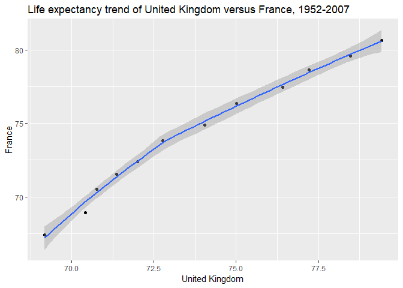

HW04: Tidy data and joins
================

-   [Data reshaping](#data-reshaping)
    -   [La vie en france, ou au royaume-uni ?](#la-vie-en-france-ou-au-royaume-uni)
-   [Join Prompts](#join-prompts)
    -   [Activity \#1](#activity-1)
-   [Exploring merge function](#exploring-merge-function)

Data reshaping
--------------

**Problem:** You have data in one “shape” but you wish it were in another. Usually this is because the alternative shape is superior for presenting a table, making a figure, or doing aggregation and statistical analysis.

**Solution:** Reshape your data. For simple reshaping, gather() and spread() from tidyr will suffice. Do the thing that is possible / easier now that your data has a new shape.

**Prompt:** Make a tibble with one row per year and columns for life expectancy for two or more countries from gapminder.

First we load the tidyverse package and gapminder dataframe.

``` r
suppressPackageStartupMessages(library(tidyverse))
suppressPackageStartupMessages(library(gapminder))
```

### La vie en france, ou au royaume-uni ?

Is life better in France or the United Kingdom? Let's explore the comparative trend in their life expectancies!

``` r
#create tibble fr_uk_lifeExp consisting of filtered gapminder data
fr_uk_lifeExp <- gapminder %>% 
  
  #capitalise year (for aesthetic purposes)
  rename(Year = year) %>% 
  
  #filter gapminder to France & United Kingdom
  filter(country == "France" | country == "United Kingdom") %>% 
  
  #select year, country, and life expectancy
  select(Year, country, lifeExp) %>% 
  
  #spread the life expectancy data by country
  spread(key = "country", value = "lifeExp")

#produce nice table
knitr::kable(fr_uk_lifeExp)
```

|  Year|  France|  United Kingdom|
|-----:|-------:|---------------:|
|  1952|  67.410|          69.180|
|  1957|  68.930|          70.420|
|  1962|  70.510|          70.760|
|  1967|  71.550|          71.360|
|  1972|  72.380|          72.010|
|  1977|  73.830|          72.760|
|  1982|  74.890|          74.040|
|  1987|  76.340|          75.007|
|  1992|  77.460|          76.420|
|  1997|  78.640|          77.218|
|  2002|  79.590|          78.471|
|  2007|  80.657|          79.425|

Now we take advantage of this data shape to make a plot of their life expectancies against each other.

``` r
#plot United Kingdom life expectancy against that of France
fr_uk_lifeExp %>% 
ggplot(aes(`United Kingdom`, France)) +
  
  #make scatter plot
  geom_point() +
  
  #interpolate using smooth curve
  geom_smooth(method = loess) +
  
  #plot title
  ggtitle("Life expectancy trend of United Kingdom versus France, 1952-2007")
```



It looks like life is good in France and the United Kingdom! We'll just have to spend some time in both :)

Join Prompts
------------

**Problem:** You have two data sources and you need info from both in one new data object.

**Solution:** Perform a join, which borrows terminology from the database world, specifically SQL.

### Activity \#1

Create a second data frame, complementary to Gapminder. Join this with (part of) Gapminder using a dplyr join function and make some observations about the process and result. Explore the different types of joins.

Before we begin, we make some remarks about the two data sets we will join.

-   We shall build a second data frame of countries consisting of Canada, United Kingdom, France, and Russia. The variables will be national animal, NATO membership, and capital city.

-   We shall use a subset of the gapminder data.frame consisting of countries Canada, France, United Kingdom, and Norway, with their respective life expectancy in the year 2007.

-   Note that we specifically chose Russia because it is NOT contained in the gapminder data frame. Moreover, Norway is NOT contained in our own constructed tibble, so there is overlap, but not completely.

-   We also chose to include continent as a column in our constructed data frame so that their are two columns (continent and country) which are the same in both data frames.

``` r
#Creating our own tibble

#column of chosen countries
countries <- c("Canada", "United Kingdom", "France", "Russia")

#column of continents corresponding to chosen countries
continent<- c("Americas", "Europe", "Europe", "Asia") 

#column of national animal of corresponding country
Anim <- c("Beaver", "Lion", "Gallic Rooster", "Bear") 

#column of NATO membership
NATO <- c("Yes", "Yes", "Yes", "No") 

#column of Capital city
Cap <- c("Ottawa", "London", "Paris", "Moscow") 

#create the tibble `addinfo` consisting of all the above columns
addinfo <- tibble(continent = continent, country = countries,  
                  `national animal` = Anim, `NATO membership` = NATO, `capital city` = Cap)


#make table of output'
knitr::kable(addinfo)
```

| continent | country        | national animal | NATO membership | capital city |
|:----------|:---------------|:----------------|:----------------|:-------------|
| Americas  | Canada         | Beaver          | Yes             | Ottawa       |
| Europe    | United Kingdom | Lion            | Yes             | London       |
| Europe    | France         | Gallic Rooster  | Yes             | Paris        |
| Asia      | Russia         | Bear            | No              | Moscow       |

This table is the `addinfo` data frame.

Now we create the filtered gapminder data frame.

``` r
#filter gapminder dataset to year 2007, 
#and the countries in the countries column created earlier,
#but include Norway
gaptemp <- gapminder %>% 
  filter(year == 2007, country%in%countries | country == "Norway") %>% 
  
  #select subset of data in 2007 (for simplicity)
  select(continent, country, lifeExp)

 
#the continent and country columns in gapminder are of `factor` type; 
#change them to `character` to match our constructed tibble above
gapfilt <- transmute(gaptemp, continent = as.character(continent), 
                     country = as.character(country), lifeExp)

knitr::kable(gapfilt)
```

| continent | country        |  lifeExp|
|:----------|:---------------|--------:|
| Americas  | Canada         |   80.653|
| Europe    | France         |   80.657|
| Europe    | Norway         |   80.196|
| Europe    | United Kingdom |   79.425|

Now let's investigate the various join functions. The two data frames have two columns in common: continent, and country. Let's see first what happens when we (left) join by country only.

``` r
#left join by country
left_join(gapfilt, addinfo, by = "country") %>% 
  knitr::kable()
```

| continent.x | country        |  lifeExp| continent.y | national animal | NATO membership | capital city |
|:------------|:---------------|--------:|:------------|:----------------|:----------------|:-------------|
| Americas    | Canada         |   80.653| Americas    | Beaver          | Yes             | Ottawa       |
| Europe      | France         |   80.657| Europe      | Gallic Rooster  | Yes             | Paris        |
| Europe      | Norway         |   80.196| NA          | NA              | NA              | NA           |
| Europe      | United Kingdom |   79.425| Europe      | Lion            | Yes             | London       |

The left join by country looks for countries in `addinfo` that match with `gapfilt` , and if found, the rows of `addinfo` are added (on the right) to `gapfilt`. Notice that the ordering of rows doesn't matter for matching (e.g. France is the second row in `gapfilt` but the third row in `addinfo`).

We see that left joining by country only, the common column of continent is not automatically recognised - instead they are treated as two distinct columns and automatically given ".x" and ".y" demarcations. Note as expected, Russia does not appear in the table, because it is not in `gapfilt`.

From here on, we join by continent and country (the default, unless specified otherwise).

``` r
left_join(gapfilt, addinfo) %>% 
  knitr::kable()
```

    ## Joining, by = c("continent", "country")

| continent | country        |  lifeExp| national animal | NATO membership | capital city |
|:----------|:---------------|--------:|:----------------|:----------------|:-------------|
| Americas  | Canada         |   80.653| Beaver          | Yes             | Ottawa       |
| Europe    | France         |   80.657| Gallic Rooster  | Yes             | Paris        |
| Europe    | Norway         |   80.196| NA              | NA              | NA           |
| Europe    | United Kingdom |   79.425| Lion            | Yes             | London       |

``` r
left_join(addinfo, gapfilt) %>% 
  knitr::kable()
```

    ## Joining, by = c("continent", "country")

| continent | country        | national animal | NATO membership | capital city |  lifeExp|
|:----------|:---------------|:----------------|:----------------|:-------------|--------:|
| Americas  | Canada         | Beaver          | Yes             | Ottawa       |   80.653|
| Europe    | United Kingdom | Lion            | Yes             | London       |   79.425|
| Europe    | France         | Gallic Rooster  | Yes             | Paris        |   80.657|
| Asia      | Russia         | Bear            | No              | Moscow       |       NA|

``` r
right_join(gapfilt, addinfo) %>% 
  knitr::kable()
```

    ## Joining, by = c("continent", "country")

| continent | country        |  lifeExp| national animal | NATO membership | capital city |
|:----------|:---------------|--------:|:----------------|:----------------|:-------------|
| Americas  | Canada         |   80.653| Beaver          | Yes             | Ottawa       |
| Europe    | United Kingdom |   79.425| Lion            | Yes             | London       |
| Europe    | France         |   80.657| Gallic Rooster  | Yes             | Paris        |
| Asia      | Russia         |       NA| Bear            | No              | Moscow       |

``` r
right_join(addinfo, gapfilt)
```

    ## Joining, by = c("continent", "country")

    ## # A tibble: 4 x 6
    ##   continent country `national anima~ `NATO membershi~ `capital city`
    ##   <chr>     <chr>   <chr>            <chr>            <chr>         
    ## 1 Americas  Canada  Beaver           Yes              Ottawa        
    ## 2 Europe    France  Gallic Rooster   Yes              Paris         
    ## 3 Europe    Norway  <NA>             <NA>             <NA>          
    ## 4 Europe    United~ Lion             Yes              London        
    ## # ... with 1 more variable: lifeExp <dbl>

``` r
right_join(gapfilt, addinfo) %>% 
  knitr::kable()
```

    ## Joining, by = c("continent", "country")

| continent | country        |  lifeExp| national animal | NATO membership | capital city |
|:----------|:---------------|--------:|:----------------|:----------------|:-------------|
| Americas  | Canada         |   80.653| Beaver          | Yes             | Ottawa       |
| Europe    | United Kingdom |   79.425| Lion            | Yes             | London       |
| Europe    | France         |   80.657| Gallic Rooster  | Yes             | Paris        |
| Asia      | Russia         |       NA| Bear            | No              | Moscow       |

``` r
inner_join(gapfilt, addinfo) %>% 
  knitr::kable()
```

    ## Joining, by = c("continent", "country")

| continent | country        |  lifeExp| national animal | NATO membership | capital city |
|:----------|:---------------|--------:|:----------------|:----------------|:-------------|
| Americas  | Canada         |   80.653| Beaver          | Yes             | Ottawa       |
| Europe    | France         |   80.657| Gallic Rooster  | Yes             | Paris        |
| Europe    | United Kingdom |   79.425| Lion            | Yes             | London       |

``` r
inner_join(addinfo, gapfilt)
```

    ## Joining, by = c("continent", "country")

    ## # A tibble: 3 x 6
    ##   continent country `national anima~ `NATO membershi~ `capital city`
    ##   <chr>     <chr>   <chr>            <chr>            <chr>         
    ## 1 Americas  Canada  Beaver           Yes              Ottawa        
    ## 2 Europe    United~ Lion             Yes              London        
    ## 3 Europe    France  Gallic Rooster   Yes              Paris         
    ## # ... with 1 more variable: lifeExp <dbl>

``` r
full_join(gapfilt, addinfo) %>% 
  knitr::kable()
```

    ## Joining, by = c("continent", "country")

| continent | country        |  lifeExp| national animal | NATO membership | capital city |
|:----------|:---------------|--------:|:----------------|:----------------|:-------------|
| Americas  | Canada         |   80.653| Beaver          | Yes             | Ottawa       |
| Europe    | France         |   80.657| Gallic Rooster  | Yes             | Paris        |
| Europe    | Norway         |   80.196| NA              | NA              | NA           |
| Europe    | United Kingdom |   79.425| Lion            | Yes             | London       |
| Asia      | Russia         |       NA| Bear            | No              | Moscow       |

``` r
bind_rows(gapfilt, addinfo) %>% 
  knitr::kable()
```

| continent | country        |  lifeExp| national animal | NATO membership | capital city |
|:----------|:---------------|--------:|:----------------|:----------------|:-------------|
| Americas  | Canada         |   80.653| NA              | NA              | NA           |
| Europe    | France         |   80.657| NA              | NA              | NA           |
| Europe    | Norway         |   80.196| NA              | NA              | NA           |
| Europe    | United Kingdom |   79.425| NA              | NA              | NA           |
| Americas  | Canada         |       NA| Beaver          | Yes             | Ottawa       |
| Europe    | United Kingdom |       NA| Lion            | Yes             | London       |
| Europe    | France         |       NA| Gallic Rooster  | Yes             | Paris        |
| Asia      | Russia         |       NA| Bear            | No              | Moscow       |

``` r
full_join(addinfo, gapfilt) %>% 
  knitr::kable()
```

    ## Joining, by = c("continent", "country")

| continent | country        | national animal | NATO membership | capital city |  lifeExp|
|:----------|:---------------|:----------------|:----------------|:-------------|--------:|
| Americas  | Canada         | Beaver          | Yes             | Ottawa       |   80.653|
| Europe    | United Kingdom | Lion            | Yes             | London       |   79.425|
| Europe    | France         | Gallic Rooster  | Yes             | Paris        |   80.657|
| Asia      | Russia         | Bear            | No              | Moscow       |       NA|
| Europe    | Norway         | NA              | NA              | NA           |   80.196|

``` r
semi_join(gapfilt, addinfo) %>% 
  knitr::kable()
```

    ## Joining, by = c("continent", "country")

| continent | country        |  lifeExp|
|:----------|:---------------|--------:|
| Americas  | Canada         |   80.653|
| Europe    | France         |   80.657|
| Europe    | United Kingdom |   79.425|

``` r
semi_join(addinfo, gapfilt) %>% 
  knitr::kable()
```

    ## Joining, by = c("continent", "country")

| continent | country        | national animal | NATO membership | capital city |
|:----------|:---------------|:----------------|:----------------|:-------------|
| Americas  | Canada         | Beaver          | Yes             | Ottawa       |
| Europe    | United Kingdom | Lion            | Yes             | London       |
| Europe    | France         | Gallic Rooster  | Yes             | Paris        |

``` r
anti_join(gapfilt, addinfo) %>% 
  knitr::kable()
```

    ## Joining, by = c("continent", "country")

| continent | country |  lifeExp|
|:----------|:--------|--------:|
| Europe    | Norway  |   80.196|

``` r
anti_join(addinfo, gapfilt) %>% 
  knitr::kable()
```

    ## Joining, by = c("continent", "country")

| continent | country | national animal | NATO membership | capital city |
|:----------|:--------|:----------------|:----------------|:-------------|
| Asia      | Russia  | Bear            | No              | Moscow       |

``` r
bind_cols(gapfilt, addinfo) %>% 
  knitr::kable()
```

| continent | country        |  lifeExp| continent1 | country1       | national animal | NATO membership | capital city |
|:----------|:---------------|--------:|:-----------|:---------------|:----------------|:----------------|:-------------|
| Americas  | Canada         |   80.653| Americas   | Canada         | Beaver          | Yes             | Ottawa       |
| Europe    | France         |   80.657| Europe     | United Kingdom | Lion            | Yes             | London       |
| Europe    | Norway         |   80.196| Europe     | France         | Gallic Rooster  | Yes             | Paris        |
| Europe    | United Kingdom |   79.425| Asia       | Russia         | Bear            | No              | Moscow       |

``` r
a <- select(gapfilt, continent, country)
b <- select(addinfo, continent, country)

knitr::kable(a)
```

| continent | country        |
|:----------|:---------------|
| Americas  | Canada         |
| Europe    | France         |
| Europe    | Norway         |
| Europe    | United Kingdom |

``` r
knitr::kable(b)
```

| continent | country        |
|:----------|:---------------|
| Americas  | Canada         |
| Europe    | United Kingdom |
| Europe    | France         |
| Asia      | Russia         |

``` r
intersect(a,b) %>% 
  knitr::kable()
```

| continent | country        |
|:----------|:---------------|
| Americas  | Canada         |
| Europe    | United Kingdom |
| Europe    | France         |

``` r
union(a,b) %>% 
  knitr::kable()
```

| continent | country        |
|:----------|:---------------|
| Americas  | Canada         |
| Europe    | Norway         |
| Asia      | Russia         |
| Europe    | France         |
| Europe    | United Kingdom |

``` r
setdiff(a,b) %>% 
  knitr::kable()
```

| continent | country |
|:----------|:--------|
| Europe    | Norway  |

``` r
setdiff(b,a) %>% 
  knitr::kable()
```

| continent | country |
|:----------|:--------|
| Asia      | Russia  |

Exploring merge function
------------------------

For simplicity we work with the following tibbles

``` r
(a <- tibble(x1 = LETTERS[1:3], x2 = 1:3))
```

    ## # A tibble: 3 x 2
    ##   x1       x2
    ##   <chr> <int>
    ## 1 A         1
    ## 2 B         2
    ## 3 C         3

``` r
(b <- tibble(x1 = LETTERS[c(1,2)], x3 = c("T", "F")))
```

    ## # A tibble: 2 x 2
    ##   x1    x3   
    ##   <chr> <chr>
    ## 1 A     T    
    ## 2 B     F

``` r
merge(a,b)
```

    ##   x1 x2 x3
    ## 1  A  1  T
    ## 2  B  2  F

``` r
left_join(a,b)
```

    ## Joining, by = "x1"

    ## # A tibble: 3 x 3
    ##   x1       x2 x3   
    ##   <chr> <int> <chr>
    ## 1 A         1 T    
    ## 2 B         2 F    
    ## 3 C         3 <NA>

``` r
right_join(a,b)
```

    ## Joining, by = "x1"

    ## # A tibble: 2 x 3
    ##   x1       x2 x3   
    ##   <chr> <int> <chr>
    ## 1 A         1 T    
    ## 2 B         2 F

``` r
merge(b,a)
```

    ##   x1 x3 x2
    ## 1  A  T  1
    ## 2  B  F  2

``` r
merge(a,b, by = "x1")
```

    ##   x1 x2 x3
    ## 1  A  1  T
    ## 2  B  2  F

``` r
match(a,b)
```

    ## [1] NA NA

``` r
match(b,a)
```

    ## [1] NA NA
