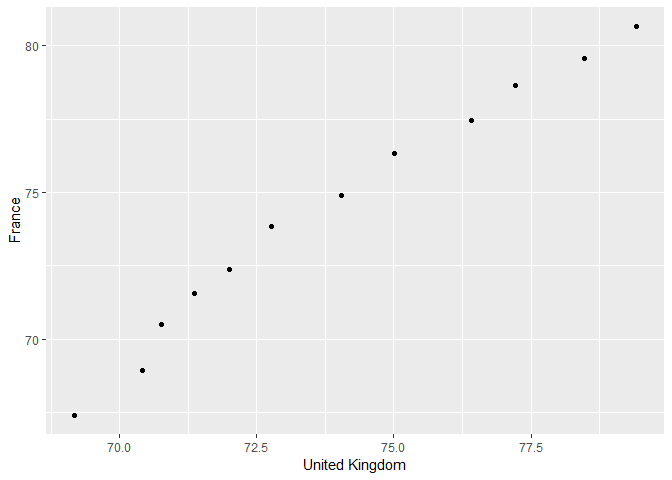

HW04: Tidy data and joins
================

-   [Data reshaping](#data-reshaping)
-   [Join Prompts](#join-prompts)
-   [intersect(addinfo, gapfilt)](#intersectaddinfo-gapfilt)
-   [union()](#union)
-   [setdiff()](#setdiff)

Data reshaping
--------------

**Problem:** You have data in one “shape” but you wish it were in another. Usually this is because the alternative shape is superior for presenting a table, making a figure, or doing aggregation and statistical analysis.

**Solution:** Reshape your data. For simple reshaping, gather() and spread() from tidyr will suffice. Do the thing that is possible / easier now that your data has a new shape.

**Prompt:** Make a tibble with one row per year and columns for life expectancy for two or more countries from gapminder.

First we load the tidyverse package and gapminder dataframe.

``` r
suppressPackageStartupMessages(library(tidyverse))
suppressPackageStartupMessages(library(gapminder))
```

``` r
fr_uk_lifeExp <- gapminder %>% 
  rename(Year = year) %>% 
  filter(country == "France" | country == "United Kingdom") %>% 
  select(Year, country, lifeExp) %>% 
  spread(key = "country", value = "lifeExp")
  colnames(fr_uk_lifeExp)
```

    ## [1] "Year"           "France"         "United Kingdom"

-   Use `knitr::kable()` to make this table look pretty in your rendered homework.

``` r
knitr::kable(fr_uk_lifeExp)
```

|  Year|  France|  United Kingdom|
|-----:|-------:|---------------:|
|  1952|  67.410|          69.180|
|  1957|  68.930|          70.420|
|  1962|  70.510|          70.760|
|  1967|  71.550|          71.360|
|  1972|  72.380|          72.010|
|  1977|  73.830|          72.760|
|  1982|  74.890|          74.040|
|  1987|  76.340|          75.007|
|  1992|  77.460|          76.420|
|  1997|  78.640|          77.218|
|  2002|  79.590|          78.471|
|  2007|  80.657|          79.425|

-   Take advantage of this new data shape to scatterplot life expectancy for one country against that of another.

``` r
fr_uk_lifeExp %>% 
ggplot(aes(`United Kingdom`, France)) +
  geom_point()
```



Join Prompts
------------

**Problem:** You have two data sources and you need info from both in one new data object.

**Solution:** Perform a join, which borrows terminology from the database world, specifically SQL.

Prompts:

Activity \#1

Create a second data frame, complementary to Gapminder. Join this with (part of) Gapminder using a dplyr join function and make some observations about the process and result. Explore the different types of joins. Examples of a second data frame you could build: One row per country, a country variable and one or more variables with extra info, such as language spoken, NATO membership, national animal, or capitol city. One row per continent, a continent variable and one or more variables with extra info, such as northern versus southern hemisphere.

We shall build a second data frame of countries, with national animal, NATO membership

``` r
#x1 <- unique(select(gapminder, continent))
#`Northern Hemisphere` <- c("Yes", "Yes", "Yes", "Yes", "No")
#`Southern Hemisphere` <- c("Yes", "No", "Yes", "Yes", "Yes")
#mutate(x1,`Northern Hemisphere`, `Southern Hemisphere`)

#Creating our own tibble

#column of chosen countries
countries <- c("Canada", "United Kingdom", "France", "Russia")

#column of continents corresponding to chosen countries
continent<- c("Americas", "Europe", "Europe", "Asia") 

#Lan <- c("English, French", "English", "French") `Official Language(s)` = Lan

#column of national animal of corresponding country
Anim <- c("Beaver", "Lion", "Gallic Rooster", "Bear") #national animal of corresponding coutries chosen above

#column of NATO membership
NATO <- c("Yes", "Yes", "Yes", "No") 

#column of Capital city
Cap <- c("Ottawa", "London", "Paris", "Moscow") 

#create the tibble `addinfo` consisting of all the above columns
(addinfo <- tibble(continent = continent, country = countries,  `national animal` = Anim, `NATO membership` = NATO, `capital city` = Cap))
```

    ## # A tibble: 4 x 5
    ##   continent country      `national animal` `NATO membershi~ `capital city`
    ##   <chr>     <chr>        <chr>             <chr>            <chr>         
    ## 1 Americas  Canada       Beaver            Yes              Ottawa        
    ## 2 Europe    United King~ Lion              Yes              London        
    ## 3 Europe    France       Gallic Rooster    Yes              Paris         
    ## 4 Asia      Russia       Bear              No               Moscow

``` r
#filter gapminder dataset to year 2007, and the countries in the countries column created earlier
(gapfilt <- gapminder %>% 
  filter(year == 2007, country%in%countries | country == "Norway") %>% 
  
  #select subset of data in 2007
  select(continent, country, lifeExp))
```

    ## # A tibble: 4 x 3
    ##   continent country        lifeExp
    ##   <fct>     <fct>            <dbl>
    ## 1 Americas  Canada            80.7
    ## 2 Europe    France            80.7
    ## 3 Europe    Norway            80.2
    ## 4 Europe    United Kingdom    79.4

``` r
#left join by country
left_join(gapfilt, addinfo, by = "country")
```

    ## Warning: Column `country` joining factor and character vector, coercing
    ## into character vector

    ## # A tibble: 4 x 7
    ##   continent.x country lifeExp continent.y `national anima~ `NATO membershi~
    ##   <fct>       <chr>     <dbl> <chr>       <chr>            <chr>           
    ## 1 Americas    Canada     80.7 Americas    Beaver           Yes             
    ## 2 Europe      France     80.7 Europe      Gallic Rooster   Yes             
    ## 3 Europe      Norway     80.2 <NA>        <NA>             <NA>            
    ## 4 Europe      United~    79.4 Europe      Lion             Yes             
    ## # ... with 1 more variable: `capital city` <chr>

``` r
left_join(gapfilt, addinfo)
```

    ## Joining, by = c("continent", "country")

    ## Warning: Column `continent` joining factor and character vector, coercing
    ## into character vector

    ## Warning: Column `country` joining factor and character vector, coercing
    ## into character vector

    ## # A tibble: 4 x 6
    ##   continent country lifeExp `national anima~ `NATO membershi~
    ##   <chr>     <chr>     <dbl> <chr>            <chr>           
    ## 1 Americas  Canada     80.7 Beaver           Yes             
    ## 2 Europe    France     80.7 Gallic Rooster   Yes             
    ## 3 Europe    Norway     80.2 <NA>             <NA>            
    ## 4 Europe    United~    79.4 Lion             Yes             
    ## # ... with 1 more variable: `capital city` <chr>

``` r
left_join(addinfo, gapfilt)
```

    ## Joining, by = c("continent", "country")

    ## Warning: Column `continent` joining character vector and factor, coercing
    ## into character vector

    ## Warning: Column `country` joining character vector and factor, coercing
    ## into character vector

    ## # A tibble: 4 x 6
    ##   continent country `national anima~ `NATO membershi~ `capital city`
    ##   <chr>     <chr>   <chr>            <chr>            <chr>         
    ## 1 Americas  Canada  Beaver           Yes              Ottawa        
    ## 2 Europe    United~ Lion             Yes              London        
    ## 3 Europe    France  Gallic Rooster   Yes              Paris         
    ## 4 Asia      Russia  Bear             No               Moscow        
    ## # ... with 1 more variable: lifeExp <dbl>

``` r
#left_join(addinfo, gapfilt , by = "country")


right_join(gapfilt, addinfo)
```

    ## Joining, by = c("continent", "country")

    ## Warning: Column `continent` joining factor and character vector, coercing
    ## into character vector

    ## Warning: Column `country` joining factor and character vector, coercing
    ## into character vector

    ## # A tibble: 4 x 6
    ##   continent country lifeExp `national anima~ `NATO membershi~
    ##   <chr>     <chr>     <dbl> <chr>            <chr>           
    ## 1 Americas  Canada     80.7 Beaver           Yes             
    ## 2 Europe    United~    79.4 Lion             Yes             
    ## 3 Europe    France     80.7 Gallic Rooster   Yes             
    ## 4 Asia      Russia     NA   Bear             No              
    ## # ... with 1 more variable: `capital city` <chr>

``` r
right_join(addinfo, gapfilt)
```

    ## Joining, by = c("continent", "country")

    ## Warning: Column `continent` joining character vector and factor, coercing
    ## into character vector

    ## Warning: Column `country` joining character vector and factor, coercing
    ## into character vector

    ## # A tibble: 4 x 6
    ##   continent country `national anima~ `NATO membershi~ `capital city`
    ##   <chr>     <chr>   <chr>            <chr>            <chr>         
    ## 1 Americas  Canada  Beaver           Yes              Ottawa        
    ## 2 Europe    France  Gallic Rooster   Yes              Paris         
    ## 3 Europe    Norway  <NA>             <NA>             <NA>          
    ## 4 Europe    United~ Lion             Yes              London        
    ## # ... with 1 more variable: lifeExp <dbl>

``` r
right_join(gapfilt, addinfo)
```

    ## Joining, by = c("continent", "country")

    ## Warning: Column `continent` joining factor and character vector, coercing
    ## into character vector

    ## Warning: Column `country` joining factor and character vector, coercing
    ## into character vector

    ## # A tibble: 4 x 6
    ##   continent country lifeExp `national anima~ `NATO membershi~
    ##   <chr>     <chr>     <dbl> <chr>            <chr>           
    ## 1 Americas  Canada     80.7 Beaver           Yes             
    ## 2 Europe    United~    79.4 Lion             Yes             
    ## 3 Europe    France     80.7 Gallic Rooster   Yes             
    ## 4 Asia      Russia     NA   Bear             No              
    ## # ... with 1 more variable: `capital city` <chr>

``` r
inner_join(gapfilt, addinfo)
```

    ## Joining, by = c("continent", "country")

    ## Warning: Column `continent` joining factor and character vector, coercing
    ## into character vector

    ## Warning: Column `country` joining factor and character vector, coercing
    ## into character vector

    ## # A tibble: 3 x 6
    ##   continent country lifeExp `national anima~ `NATO membershi~
    ##   <chr>     <chr>     <dbl> <chr>            <chr>           
    ## 1 Americas  Canada     80.7 Beaver           Yes             
    ## 2 Europe    France     80.7 Gallic Rooster   Yes             
    ## 3 Europe    United~    79.4 Lion             Yes             
    ## # ... with 1 more variable: `capital city` <chr>

``` r
inner_join(addinfo, gapfilt)
```

    ## Joining, by = c("continent", "country")

    ## Warning: Column `continent` joining character vector and factor, coercing
    ## into character vector

    ## Warning: Column `country` joining character vector and factor, coercing
    ## into character vector

    ## # A tibble: 3 x 6
    ##   continent country `national anima~ `NATO membershi~ `capital city`
    ##   <chr>     <chr>   <chr>            <chr>            <chr>         
    ## 1 Americas  Canada  Beaver           Yes              Ottawa        
    ## 2 Europe    United~ Lion             Yes              London        
    ## 3 Europe    France  Gallic Rooster   Yes              Paris         
    ## # ... with 1 more variable: lifeExp <dbl>

``` r
full_join(gapfilt, addinfo)
```

    ## Joining, by = c("continent", "country")

    ## Warning: Column `continent` joining factor and character vector, coercing
    ## into character vector

    ## Warning: Column `country` joining factor and character vector, coercing
    ## into character vector

    ## # A tibble: 5 x 6
    ##   continent country lifeExp `national anima~ `NATO membershi~
    ##   <chr>     <chr>     <dbl> <chr>            <chr>           
    ## 1 Americas  Canada     80.7 Beaver           Yes             
    ## 2 Europe    France     80.7 Gallic Rooster   Yes             
    ## 3 Europe    Norway     80.2 <NA>             <NA>            
    ## 4 Europe    United~    79.4 Lion             Yes             
    ## 5 Asia      Russia     NA   Bear             No              
    ## # ... with 1 more variable: `capital city` <chr>

``` r
bind_rows(gapfilt, addinfo)
```

    ## Warning in bind_rows_(x, .id): binding factor and character vector,
    ## coercing into character vector

    ## Warning in bind_rows_(x, .id): binding character and factor vector,
    ## coercing into character vector

    ## Warning in bind_rows_(x, .id): binding factor and character vector,
    ## coercing into character vector

    ## Warning in bind_rows_(x, .id): binding character and factor vector,
    ## coercing into character vector

    ## # A tibble: 8 x 6
    ##   continent country lifeExp `national anima~ `NATO membershi~
    ##   <chr>     <chr>     <dbl> <chr>            <chr>           
    ## 1 Americas  Canada     80.7 <NA>             <NA>            
    ## 2 Europe    France     80.7 <NA>             <NA>            
    ## 3 Europe    Norway     80.2 <NA>             <NA>            
    ## 4 Europe    United~    79.4 <NA>             <NA>            
    ## 5 Americas  Canada     NA   Beaver           Yes             
    ## 6 Europe    United~    NA   Lion             Yes             
    ## 7 Europe    France     NA   Gallic Rooster   Yes             
    ## 8 Asia      Russia     NA   Bear             No              
    ## # ... with 1 more variable: `capital city` <chr>

``` r
full_join(addinfo, gapfilt)
```

    ## Joining, by = c("continent", "country")

    ## Warning: Column `continent` joining character vector and factor, coercing
    ## into character vector

    ## Warning: Column `country` joining character vector and factor, coercing
    ## into character vector

    ## # A tibble: 5 x 6
    ##   continent country `national anima~ `NATO membershi~ `capital city`
    ##   <chr>     <chr>   <chr>            <chr>            <chr>         
    ## 1 Americas  Canada  Beaver           Yes              Ottawa        
    ## 2 Europe    United~ Lion             Yes              London        
    ## 3 Europe    France  Gallic Rooster   Yes              Paris         
    ## 4 Asia      Russia  Bear             No               Moscow        
    ## 5 Europe    Norway  <NA>             <NA>             <NA>          
    ## # ... with 1 more variable: lifeExp <dbl>

``` r
semi_join(gapfilt, addinfo)
```

    ## Joining, by = c("continent", "country")

    ## Warning: Column `continent` joining factor and character vector, coercing
    ## into character vector

    ## Warning: Column `country` joining factor and character vector, coercing
    ## into character vector

    ## # A tibble: 3 x 3
    ##   continent country        lifeExp
    ##   <fct>     <fct>            <dbl>
    ## 1 Americas  Canada            80.7
    ## 2 Europe    France            80.7
    ## 3 Europe    United Kingdom    79.4

``` r
semi_join(addinfo, gapfilt)
```

    ## Joining, by = c("continent", "country")

    ## Warning: Column `continent` joining character vector and factor, coercing
    ## into character vector

    ## Warning: Column `country` joining character vector and factor, coercing
    ## into character vector

    ## # A tibble: 3 x 5
    ##   continent country      `national animal` `NATO membershi~ `capital city`
    ##   <chr>     <chr>        <chr>             <chr>            <chr>         
    ## 1 Americas  Canada       Beaver            Yes              Ottawa        
    ## 2 Europe    United King~ Lion              Yes              London        
    ## 3 Europe    France       Gallic Rooster    Yes              Paris

``` r
anti_join(gapfilt, addinfo)
```

    ## Joining, by = c("continent", "country")

    ## Warning: Column `continent` joining factor and character vector, coercing
    ## into character vector

    ## Warning: Column `country` joining factor and character vector, coercing
    ## into character vector

    ## # A tibble: 1 x 3
    ##   continent country lifeExp
    ##   <fct>     <fct>     <dbl>
    ## 1 Europe    Norway     80.2

``` r
anti_join(addinfo, gapfilt)
```

    ## Joining, by = c("continent", "country")

    ## Warning: Column `continent` joining character vector and factor, coercing
    ## into character vector

    ## Warning: Column `country` joining character vector and factor, coercing
    ## into character vector

    ## # A tibble: 1 x 5
    ##   continent country `national animal` `NATO membership` `capital city`
    ##   <chr>     <chr>   <chr>             <chr>             <chr>         
    ## 1 Asia      Russia  Bear              No                Moscow

``` r
bind_cols(gapfilt, addinfo)
```

    ## # A tibble: 4 x 8
    ##   continent country lifeExp continent1 country1 `national anima~
    ##   <fct>     <fct>     <dbl> <chr>      <chr>    <chr>           
    ## 1 Americas  Canada     80.7 Americas   Canada   Beaver          
    ## 2 Europe    France     80.7 Europe     United ~ Lion            
    ## 3 Europe    Norway     80.2 Europe     France   Gallic Rooster  
    ## 4 Europe    United~    79.4 Asia       Russia   Bear            
    ## # ... with 2 more variables: `NATO membership` <chr>, `capital city` <chr>

``` r
(a <- select(gapfilt, continent, country))
```

    ## # A tibble: 4 x 2
    ##   continent country       
    ##   <fct>     <fct>         
    ## 1 Americas  Canada        
    ## 2 Europe    France        
    ## 3 Europe    Norway        
    ## 4 Europe    United Kingdom

``` r
(b <- select(addinfo, continent, country))
```

    ## # A tibble: 4 x 2
    ##   continent country       
    ##   <chr>     <chr>         
    ## 1 Americas  Canada        
    ## 2 Europe    United Kingdom
    ## 3 Europe    France        
    ## 4 Asia      Russia

``` r
intersect(a,b)
```

    ## Warning: Column `continent` joining factor and character vector, coercing
    ## into character vector

    ## Warning: Column `country` joining factor and character vector, coercing
    ## into character vector

    ## # A tibble: 3 x 2
    ##   continent country       
    ##   <chr>     <chr>         
    ## 1 Americas  Canada        
    ## 2 Europe    United Kingdom
    ## 3 Europe    France

``` r
union(a,b)
```

    ## Warning: Column `continent` joining factor and character vector, coercing
    ## into character vector

    ## Warning: Column `country` joining factor and character vector, coercing
    ## into character vector

    ## # A tibble: 5 x 2
    ##   continent country       
    ##   <chr>     <chr>         
    ## 1 Europe    Norway        
    ## 2 Asia      Russia        
    ## 3 Europe    United Kingdom
    ## 4 Americas  Canada        
    ## 5 Europe    France

``` r
setdiff(a,b)
```

    ## Warning: Column `continent` joining character vector and factor, coercing
    ## into character vector

    ## Warning: Column `country` joining character vector and factor, coercing
    ## into character vector

    ## # A tibble: 1 x 2
    ##   continent country
    ##   <chr>     <chr>  
    ## 1 Europe    Norway

``` r
setdiff(b,a)
```

    ## Warning: Column `continent` joining factor and character vector, coercing
    ## into character vector

    ## Warning: Column `country` joining factor and character vector, coercing
    ## into character vector

    ## # A tibble: 1 x 2
    ##   continent country
    ##   <chr>     <chr>  
    ## 1 Asia      Russia

intersect(addinfo, gapfilt)
===========================

union()
=======

setdiff()
=========
